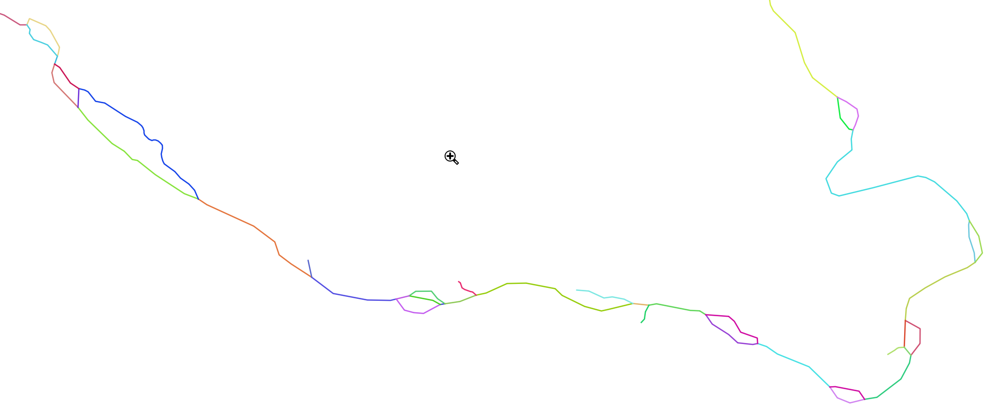
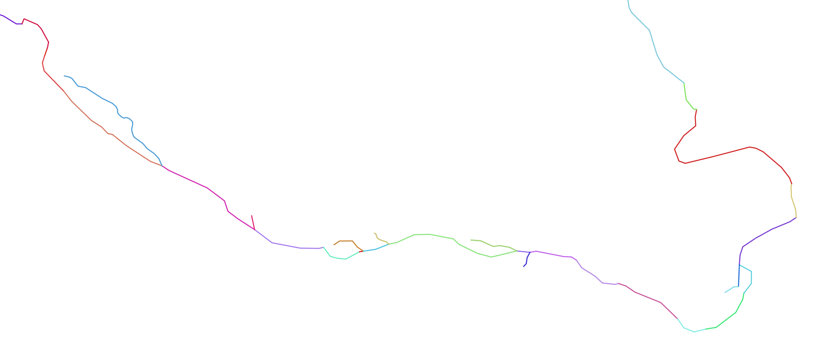

#########
Algorithm
#########

*************************
Overview
*************************

A list of algorithms is implemented to carry out the following operations:

1. Flowline simplification
2. Mesh generations
3. Topological relationship reconstruction

*************************
Flowline simplification
*************************

==============================
Dam associate flowline burning
==============================

(Optional)

Through a look-up table that links dams with their associated flowlines, this algorithm includes all the downstream flowlines of each dam into the flowline simplification process.

Currently, this algorithm does not include the upstream of a dam.

==============================
Flowline vertex extraction
==============================

The vertices that make up flowlines are used in several algorithms. Among them, a flowline's start and end vertices also define the flowline type. 

* If the start vertex has no upstream, the flowline is a headwater.
* If the start or end vertex has only one upstream or downstream, it is a middle flowline and can be merged with others. 
* If a start vertex has more than one upstream vertices, it is a river confluence.

==============================
Split flowline
==============================

With all the flowlines and vertices, the algorithm split the flowlines into a minimal set that meets the following requirement:

* All flowlines' start and end vertices are made up by the vertex loop-up table.
* No flowline has a middle vertex that belongs to the same look-up table.

==============================
Flow direction correction
==============================

Due to data quality issues, the existing flowlines may have incorrect flow directions, which lead to multiple downstream flow directions. 
The corresponding node connection matrix has rows with multiple **1**s. This algorithm scans from the outlet vertex and searches reversely; once such a row is detected, the corresponding flow direction is reversed.

.. image:: ../figures/flow_direction_matrix.png
  :width: 400
  :alt: Flow direction correction

==============================
Remove small river
==============================

To simplify the river networks, small rivers with lengths less than the user-provided threshold are removed. This algorithm only applies to headwater and should be called multiple times to achieve desired performance.

(Optional)
When the dam burning is turned on, the dam-associated flowlines are always retained even if their lengths are less than the user-provided threshold.

==============================
Remove braided flowlines
==============================

A braided loop occurs when a vertex has more than one downstream, even after the flow direction correction. This algorithm removes these loops by only keeping the first detected downstream of any vertex.

==============================
Flowline confluence extraction
==============================

This algorithm scans the whole network and defines the vertices that have more than one upstream flowline as river confluences.

==============================
Merge flowline
==============================

This algorithm merges flowlines, so there are only two types of flowlines:

1. headwaters

2. flowline between the confluences

If there are multiple flowlines within the same confluence bound, they are merged as one.

.. image:: ../figures/merge_flowline.png
  :width: 400
  :alt: Flowline merge

==============================
Flowline confluence definition
==============================

After the flowlines are in the final format, the confluences are redefined using the same criteria as above.

==============================
Stream segment index
==============================

This algorithm defines the stream segment index using the class method.

==============================
Stream segment order
==============================

This algorithm defines the stream order based on the stream segment topology.

==============================
Split flowline by length
==============================

(Optional)

In some cases, it is desirable to impose a maximum flowline edge length so it can be used in other applications.
This algorithm divides such kinds of edges until they meet the requirement.

*************************
Mesh generation
*************************

PyFlowline provides several algorithms to generate structured meshes, including latitude-longitude, projected, hexagon, triangle meshes.

The hexagon mesh generator also provides an option for a 60-degree rotation.

PyFlowline uses the geographic coordinate system (GCS) exclusively for all the computational geometry, all the meshes are converted to the GCS system. See the hexagon mesh for an example.

==============================
Structured mesh
==============================

In general, the mesh generator creates mesh cells one by one in a pre-defined row-column order. The generator calculates the locations of all vertices of each mesh cell. The coordinates may be converted back to GCS depending on whether the mesh is GCS or PCS.

Usually, the domain's boundary is defined in the configuration file, and the algorithm starts from the lower left.

------------------
Latitude-longitude
------------------

------------------
Projected
------------------

------------------
Hexagon
------------------

----------
Triangle
----------

==============================
Unstructured mesh
==============================

PyFlowline does not provide unstructured mesh generations. Instead, the user should use third-party generators such as the JIGSAW to generate the mesh files. PyFlowline only provides algorithms to import these mesh files and convert them to PyFlowline-supported mesh data type.

------------------
MPAS
------------------

------------------
TIN
------------------

*******************************************
Topological relationship reconstruction
*******************************************

==============================
Mesh and flowline intersection
==============================

This algorithm calls the GDAL APIs to intersect the mesh with the simplified river network. Each stream segment is broken into reaches.

=======================================
Topological relationship reconstruction
=======================================

After the intersection, this algorithm rebuilds the topologic relationship using the entrance and exit vertices of each reach to construct the reach-based or cell center-based river network.

==============================
Remove returning flowline
==============================

This algorithm simplifies the topology information for several unusual scenarios. For example, if a flowline leaves and reenters the same mesh cell through the same edge, this creates a loop in topology and will be simplified. 