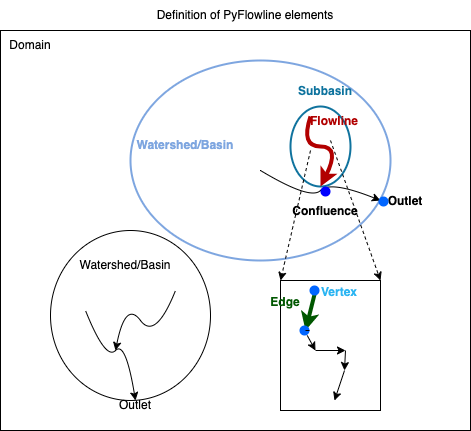

##########
Data model
##########

*********
Basic
*********

River networks are represented using three basic elements: vertex, edge, and flowline.

.. image:: ../../figures/basic_element.png
  :width: 400
  :alt: Basic elements

Within PyFlowline, these three elements are combined with several other data structures.

  
This figure illustrates a domain containing two watersheds/basins. Each basin has an outlet. Within each basin, there are several subbasins and confluences. The lower right is a zoom-in view of a flowline.

****************************************************
Spatial references and computational geometry
****************************************************

All the internal data elements use the geographic coordinate system (GCS).

All the computational geometry algorithms are based on GCS:

+------------------------+-----------------------+-------------------+--------------+
|                        | Input                 | Output            | Algorithm    |
|                        |                       |                   |              |
+========================+=======================+===================+==============+
| Location               | vertex(lon, lat)      | vertex(lon, lat)  |              |
+------------------------+-----------------------+-------------------+--------------+
| Distance               | vertex A, B           | Distance (m)      | Great circle |
+------------------------+-----------------------+-------------------+--------------+
| Area                   | vertex A, B, C, ... D | Distance (m2)     | Spheric area |
+------------------------+-----------------------+-------------------+--------------+

*********
File I/O
*********

==============================
Configuration files
==============================

PyFlowline uses two JSON-format configuration files to manage all input information, where major model input parameters and paths are specified. These configuration files have a parent-child relationship:

1. The parent configuration file stores parameters for the entire domain.
2. The child configuration file stores parameters for each individual watershed.

These files serve as the entry point for setting up and running a PyFlowline case. They can exist wherever the user prefers, but PyFlowline uses the paths specified in these files to locate model inputs and write outputs. Model inputs, outputs, and a recommended directory structure are described in the following two sections.

To create a new PyFlowline case, pass the full path to the parent configuration file to the `pyflowline_read_configuration_file` function. This will return a PyFlowline object configured with the values from the file, and it can be used to run the model. See the example notebooks for a demonstration.

Note that the "parent" configuration file contains one block of parameter-value pairs that apply to the entire domain. In contrast, the "child" configuration file contains one block of parameter-value pairs for each watershed. A domain with a single watershed will have a single block in the "child" configuration file, while a domain with multiple watersheds will have multiple blocks.

An example parent JSON file for the Susquehanna River Basin domain (with <domain_name> as "susquehanna") is provided below:

::

    {
        "sFilename_model_configuration": "/full/path/to/pyflowline/pyflowline/config/hexwatershed_susquehanna_mpas.json",
        "sWorkspace_data": "/full/path/to/input/data",
        "sWorkspace_output": "/full/path/to/output",
        "sWorkspace_project": "/hexwatershed/susquehanna",
        "sWorkspace_bin": "/full/path/to/bin",
        "sRegion": "susquehanna",
        "sModel": "pyflowline",
        "sJob": "hex",   
        "iFlag_standalone": 1,      
        "iFlag_create_mesh": 1,
        "iFlag_mesh_boundary": 1,
        "iFlag_save_mesh" :1 ,
        "iFlag_simplification": 1,
        "iFlag_intersect": 1,
        "iFlag_flowline":1,
        "iFlag_use_mesh_dem":1,
        "iFlag_global": 0,
        "iFlag_multiple_outlet": 0,
        "iFlag_rotation": 0, 
        "iFlag_mesh_boundary": 0,
        "iCase_index": 1,
        "iMesh_type": 4,    
        "dLongitude_left": -79,
        "dLongitude_right": -74.5,
        "dLatitude_bot": 39.20,
        "dLatitude_top": 42.8,
        "dResolution_degree": 5000,
        "dResolution_meter": 5000,    
        "sDate": "20220110",        
        "sMesh_type": "mpas",       
        "sFilename_spatial_reference": "/full/path/to/pyhexwatershed_icom/data/susquehanna/input/boundary_proj_buff.shp",
        "sFilename_dem": "/full/path/to/pyhexwatershed_icom/data/susquehanna/input/dem_buff_ext.tif",     
        "sFilename_mesh_netcdf": "/full/path/to/lnd_cull_mesh.nc",
        "sFilename_mesh_boundary": "/full/path/to/pyflowline/data/susquehanna/input/boundary_wgs.geojson",
        "sFilename_basins": "/full/path/to/pyflowline/examples/susquehanna/pyflowline_susquehanna_basins.json"
    }

+--------------------------------+------------+-----------------------------------------+----------------+------------------------------------------+
| Parameter                      | Data type  | Usage                                   | Default value  | Note                                     |
|                                |            |                                         |                |                                          |
+================================+============+=========================================+================+==========================================+
| sFilename_model_configuration  | string     | The filename of the configuration file  | None           | Automatically generated                  |
+--------------------------------+------------+-----------------------------------------+----------------+------------------------------------------+
| sWorkspace_data                | string     | The workspace for data                  | None           | Unused                                   |
+--------------------------------+------------+-----------------------------------------+----------------+------------------------------------------+
| sWorkspace_output              | string     | The output workspace                    | None           | The output folder                        |
+--------------------------------+------------+-----------------------------------------+----------------+------------------------------------------+
| sWorkspace_project             | string     | The project workspace                   | None           | Unused                                   |
+--------------------------------+------------+-----------------------------------------+----------------+------------------------------------------+
| sWorkspace_bin                 | string     | The workspace for binary executable     | None           | Reserved for HexWatershed model          |
+--------------------------------+------------+-----------------------------------------+----------------+------------------------------------------+
| sRegion                        | string     | Study region (domain name)              | None           | None                                     |
+--------------------------------+------------+-----------------------------------------+----------------+------------------------------------------+
| sModel                         | string     | Model name                              | pyflowline     | None                                     |
+--------------------------------+------------+-----------------------------------------+----------------+------------------------------------------+
| sJob                           | string     | HPC batch job name                      | pyflowline     | None                                     |
+--------------------------------+------------+-----------------------------------------+----------------+------------------------------------------+
| iFlag_standalone               | int        | Flag to run pyflowlone standalone       |  1             | 0 when called by hexwatershed            |
+--------------------------------+------------+-----------------------------------------+----------------+------------------------------------------+
| iFlag_mesh_boundary            | int        | Flag to use mesh boundary file          |  1             | If 0, use dLongitude/Latitude_left/right |
+--------------------------------+------------+-----------------------------------------+----------------+------------------------------------------+
| iFlag_create_mesh              | int        | Flag to create mesh                     |  1             | None                                     |
+--------------------------------+------------+-----------------------------------------+----------------+------------------------------------------+
| iFlag_save_mesh                | int        | Flag to save mesh                       |  1             | None                                     |
+--------------------------------+------------+-----------------------------------------+----------------+------------------------------------------+
| iFlag_simplification           | int        | Flag to simplification                  |  1             | None                                     |
+--------------------------------+------------+-----------------------------------------+----------------+------------------------------------------+
| iFlag_intersect                | int        | Flag to intersect                       |  1             | None                                     |
+--------------------------------+------------+-----------------------------------------+----------------+------------------------------------------+
| iFlag_flowline                 | int        | Flag for flowline                       |  1             | None                                     |
+--------------------------------+------------+-----------------------------------------+----------------+------------------------------------------+
| iFlag_use_mesh_dem             | int        | Flag to use DEM data                    |  0             | Not used                                 |
+--------------------------------+------------+-----------------------------------------+----------------+------------------------------------------+
| iFlag_global                   | int        | Flag to run on global scale             |  0             | None                                     |
+--------------------------------+------------+-----------------------------------------+----------------+------------------------------------------+
| iFlag_multiple_outlet          | int        | Flag to run with multi-outlet           |  0             | None                                     |
+--------------------------------+------------+-----------------------------------------+----------------+------------------------------------------+
| iFlag_rotation                 | int        | Flag for hexagon rotation               |  0             | None                                     |
+--------------------------------+------------+-----------------------------------------+----------------+------------------------------------------+
| iCase_index                    | int        | Index of case                           |  1             | None                                     |
+--------------------------------+------------+-----------------------------------------+----------------+------------------------------------------+
| iMesh_type                     | int        | Type of mesh                            |  1             | None                                     |
+--------------------------------+------------+-----------------------------------------+----------------+------------------------------------------+
| dLongitude_left                | float      | Boundary                                |  -180          | None                                     |
+--------------------------------+------------+-----------------------------------------+----------------+------------------------------------------+
| dLongitude_right               | float      | Boundary                                |  +180          | None                                     |
+--------------------------------+------------+-----------------------------------------+----------------+------------------------------------------+
| dLatitude_bot                  | float      | Boundary                                |  -90           | None                                     |
+--------------------------------+------------+-----------------------------------------+----------------+------------------------------------------+
| dLatitude_top                  | float      | Boundary                                |  +90           | None                                     |
+--------------------------------+------------+-----------------------------------------+----------------+------------------------------------------+
| dResolution_degree             | float      | Resolution in degree                    |  1             | None                                     |
+--------------------------------+------------+-----------------------------------------+----------------+------------------------------------------+
| dResolution_meter              | float      | Resolution in meter                     |  5000          | None                                     |
+--------------------------------+------------+-----------------------------------------+----------------+------------------------------------------+
| sDate                          | string     | Date of simulation                      |  None          | None                                     |
+--------------------------------+------------+-----------------------------------------+----------------+------------------------------------------+
| sMesh_type                     | string     | Mesh type                               |  None          | None                                     |
+--------------------------------+------------+-----------------------------------------+----------------+------------------------------------------+
| sFilename_spatial_reference    | string     | Spatial reference                       |  None          | None                                     |
+--------------------------------+------------+-----------------------------------------+----------------+------------------------------------------+
| sFilename_dem                  | string     | DEM file                                |  None          | Reserved for HexWatershed model          |
+--------------------------------+------------+-----------------------------------------+----------------+------------------------------------------+
| sFilename_mesh_netcdf          | string     | Netcdf mesh file                        |  None          |                                          |
+--------------------------------+------------+-----------------------------------------+----------------+------------------------------------------+
| sFilename_mesh_boundary        | string     | Domain boundary file                    |  None          | Required if iFlag_mesh_boundary = 0      |
+--------------------------------+------------+-----------------------------------------+----------------+------------------------------------------+
| sFilename_basins               | string     | Filename of child JSON file             |  None          | None                                     |
+--------------------------------+------------+-----------------------------------------+----------------+------------------------------------------+

An example child JSON file is provided below:

::

    [
    {
        "dLatitude_outlet_degree": 39.4620,
        "dLongitude_outlet_degree": -76.0093,    
        "dAccumulation_threshold": 100000,
        "dThreshold_small_river": 10000,
        "iFlag_dam": 0,
        "iFlag_debug":1,
        "iFlag_disconnected": 0,
        "lBasinID": 1,
        "sFilename_dam": "/full/path/to/hexwatershed/susquehanna/auxiliary/dams.csv",
        "sFilename_flowline_filter": "/full/path/to/pyflowline/data/susquehanna/input/flowline.geojson",
        "sFilename_flowline_raw": "/full/path/to/hexwatershed/susquehanna/vector/hydrology/allflowline.shp",
        "sFilename_flowline_topo": "/full/path/to/hexwatershed/susquehanna/auxiliary/flowline.csv"
    }
    ]

+--------------------------------+------------+-----------------------------------------+----------------+-------------------------------------+
| Parameter                      | Data type  | Usage                                   | Default value  | Note                                |
|                                |            |                                         |                |                                     |
+================================+============+=========================================+================+=====================================+
| dLatitude_outlet_degree        | float      | The latitude of outlet                  | None           |                                     |
+--------------------------------+------------+-----------------------------------------+----------------+-------------------------------------+
| dLongitude_outlet_degree       | float      | The longitude of outlet                 |                |                                     |
+--------------------------------+------------+-----------------------------------------+----------------+-------------------------------------+
| dAccumulation_threshold        | float      | The flow accumulation threshold         |                |                                     |
+--------------------------------+------------+-----------------------------------------+----------------+-------------------------------------+
| dThreshold_small_river         | float      | The small river threshold               |                |                                     |
+--------------------------------+------------+-----------------------------------------+----------------+-------------------------------------+
| iFlag_dam                      | int        | Flag for dam burning                    |  0             |                                     |
+--------------------------------+------------+-----------------------------------------+----------------+-------------------------------------+
| iFlag_debug                    | int        | Flag to turn on debug info              |  0             |                                     |
+--------------------------------+------------+-----------------------------------------+----------------+-------------------------------------+
| iFlag_disconnected             | int        | Flag for disconnected flowline          |  0             |                                     |
+--------------------------------+------------+-----------------------------------------+----------------+-------------------------------------+
| lBasinID                       | int        | Basin/watershed ID                      |  0             |                                     |
+--------------------------------+------------+-----------------------------------------+----------------+-------------------------------------+
| sFilename_dam                  | string     | Filename of dam file                    |  1             | Only used for dam burning           |
+--------------------------------+------------+-----------------------------------------+----------------+-------------------------------------+
| sFilename_flowline_filter      | string     | Filename of original flowline file      |                | GeoJSON format                      |
+--------------------------------+------------+-----------------------------------------+----------------+-------------------------------------+
| sFilename_flowline_raw         | string     | Filename of flowline including dam      |                | Only used for dam burning           |
+--------------------------------+------------+-----------------------------------------+----------------+-------------------------------------+
| sFilename_flowline_topo        | string     | Filename of dam topology                |                | Only used for dam burning           |
+--------------------------------+------------+-----------------------------------------+----------------+-------------------------------------+

==============================
Inputs
==============================

The following recommended workspace structure and example input files are provided to run a PyFlowline simulation. Although the repo includes example configuration files in the examples/ directory, they can be placed wherever the user prefers, as long as the paths within them point to the correct locations for input (and output) data.

::

    data
    └── <domain_name>
        ├── input
        │   ├── boundary_wgs.geojson
        │   ├── flowline.geojson
        │   ├── pyflowline_<domain_name>_<meshtype>.json
        │   └── pyflowline_<domain_name>_basins.json
        └── output
            └── ...

==============================
Outputs
==============================

After running the PyFlowline simulation, the output workspace will be structured as follows:

::

	data
	└── <domain_name>
		├── input
		│   ...
		└── output
		    └── <pyflowline_casename>
		        ├── 00000001
		        │   ├── basin_info.json
		        │   ├── confluence_conceptual_info.json
		        │   ├── confluence_simplified_info.json
		        │   ├── flowline_conceptual.json
		        │   ├── flowline_conceptual_info.json
		        │   ├── flowline_edge.json
		        │   ├── flowline_filter.json
		        │   ├── flowline_intersect_mesh.json
		        │   ├── flowline_simplified.json
		        │   ├── flowline_simplified_info.json
		        │   └── vertex_simplified.json
				├── 00000002
		        │   ├── basin_info.json
		        │   ├── confluence_conceptual_info.json
				│   └── ...
		        ├── mpas.json
		        ├── mpas_mesh_info.json
			    ├── run_pyflowline.py          
			    ├── submit.job
			    ├── stdout.out
			    └── stderr.err

The sub-folders `00000001` et. al, are results for every watershed. Within each watershed sub-folder, there are both json and geojson model output files. The primary (and final) PyFlowline model-generated flowline is `flowline_conceptual.json`. This file is in the GEOJSON format, and can be viewed directly in QGIS or similar software. Other files that may be of particular interest to users include the model-generated mesh file `mpas_mesh_info.json` which contains a complete description of the model-generated mesh, and `mpas.json` which contains the same information in the GEOJSON format, and can be viewed directly in QGIS or similar software. In the <pyflowline_casename> root directory, three HPC-associated files `submit.job`, `stdout.out`, `stderr.err` are generated. The script `run_pyflowline.py` is the python script that was ran by the HPC job. If you are running on a local machine, you can run this script directly. The table below describes the output files. 

+----------------------------------------+-------------------------------------------------------------------------------------------------------------------------+
| Filename                               | Description                                                                                                             |
|                                        |                                                                                                                         |
+========================================+=========================================================================================================================+
| basin_info.json                        | Basin configuration information output file.                                                                            |
+----------------------------------------+-------------------------------------------------------------------------------------------------------------------------+
| confluence_conceptual_info.json        | Complete description of conceptual flowline confluence nodes.                                                           |
+----------------------------------------+-------------------------------------------------------------------------------------------------------------------------+
| confluence_simplified_info.json        | Complete description of simplified flowline confluence nodes.                                                           |
+----------------------------------------+-------------------------------------------------------------------------------------------------------------------------+
| flowline_conceptual.json               | Final modeled flowline in GEOJSON format.                                                                               |
+----------------------------------------+-------------------------------------------------------------------------------------------------------------------------+
| flowline_conceptual_info.json          | Final modeled flowline in JSON format.                                                                                  |
+----------------------------------------+-------------------------------------------------------------------------------------------------------------------------+
| flowline_edge.json                     |                                                                                                                         |
+----------------------------------------+-------------------------------------------------------------------------------------------------------------------------+
| flowline_filter.json                   |                                                                                                                         |
+----------------------------------------+-------------------------------------------------------------------------------------------------------------------------+
| flowline_intersect_mesh.json           | Intermediate modeled flowline in GEOJSON format.                                                                        |
+----------------------------------------+-------------------------------------------------------------------------------------------------------------------------+
| flowline_simplified.json               | Intermediate modeled flowline in GEOJSON format.                                                                        |
+----------------------------------------+-------------------------------------------------------------------------------------------------------------------------+
| flowline_simplified_info.json          | Intermediate modeled flowline in JSON format.                                                                           |
+----------------------------------------+-------------------------------------------------------------------------------------------------------------------------+
| vertex_simplified.json                 | Flowline vertex file in GEOJSON format.                                                                                 |
+----------------------------------------+-------------------------------------------------------------------------------------------------------------------------+
| mpas.json                              | Model generated mesh file in GEOJSON format. Contains complete mesh description.                                        |
+----------------------------------------+-------------------------------------------------------------------------------------------------------------------------+
| mpas_mesh_info.json                    | Model generated mesh file in JSON format. Contains complete mesh description.                                           |
+----------------------------------------+-------------------------------------------------------------------------------------------------------------------------+
| run_pyflowline.py                      | Python script that was run by the HPC job (can be run directly on a local machine).                                     |
+----------------------------------------+-------------------------------------------------------------------------------------------------------------------------+
| submit.job                             | HPC associated file                                                                                                     |
+----------------------------------------+-------------------------------------------------------------------------------------------------------------------------+
| stdout.out                             | HPC associated file                                                                                                     |
+----------------------------------------+-------------------------------------------------------------------------------------------------------------------------+
| stderr.err                             | HPC associated file                                                                                                     |
+----------------------------------------+-------------------------------------------------------------------------------------------------------------------------+