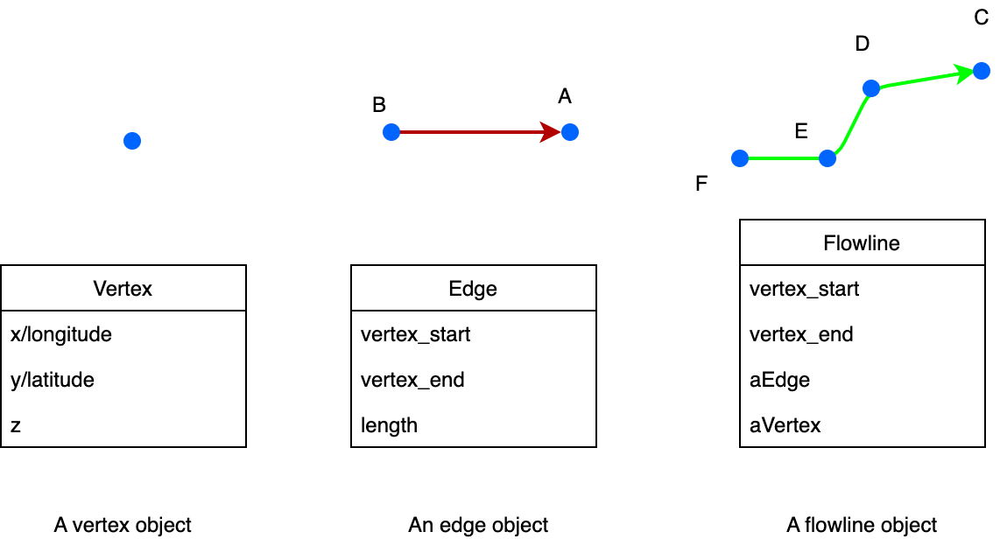

##########
Data model
##########

*********
Basic
*********

River networks are represented using three basic elements: vertex, edge, and flowline.

****************************************************
Spatial references and computational geometry
****************************************************

All the internal data elements use the geographic coordinate system (GCS).

All the computational geometry algorithms are based on GCS:

+------------------------+-----------------------+-------------------+--------------+
|                        | Input                 | Output            | Algorithm    |
|                        |                       |                   |              |
+========================+=======================+===================+==============+
| Location               | vertex(lon, lat)      |  vertex(lon, lat) |              |
+------------------------+-----------------------+-------------------+--------------+
| Distance               | vertex A, B           | Distance (m)      | Great circle |
+------------------------+-----------------------+-------------------+--------------+
| Area                   | vertex A, B, C, ... D | Distance (m2)     | Spheric area |
+------------------------+-----------------------+-------------------+--------------+

*********
File I/O
*********

==============================
Inputs
==============================

PyFlowline uses two configuration files to manage all the input information. Within this configuration file, it stores major model input parameters paths to input files. 

These two configuration files have a parent-child relationship:
1. The parent configuration file stores parameters for the whole domain, and
2. The child configuration file stores parameters for each single watershed.

Both configuration files are in JSON format.

An example parent JSON file is provided below:

::

    {
        "sFilename_model_configuration": "/qfs/people/liao313/workspace/python/pyflowline/pyflowline/config/hexwatershed_susquehanna_mpas.json",
        "sWorkspace_data": "/people/liao313/data",    
        "sWorkspace_output": "/compyfs/liao313/04model/pyflowline/susquehanna",
        "sWorkspace_project": "/hexwatershed/susquehanna",
        "sWorkspace_bin": "/people/liao313/bin",
        "sRegion": "susquehanna",
        "sModel": "pyflowline",
        "sJob": "hex",   
        "iFlag_standalone": 1,      
        "iFlag_create_mesh": 1,
        "iFlag_save_mesh" :1 ,
        "iFlag_simplification": 1,
        "iFlag_intersect": 1,
        "iFlag_flowline":1,
        "iFlag_use_mesh_dem":1,
        "iFlag_global": 0,
        "iFlag_multiple_outlet": 0,
        "iFlag_rotation": 0, 
        "iCase_index": 1,
        "iMesh_type": 1,    
        "dLongitude_left": -79,
        "dLongitude_right": -74.5,
        "dLatitude_bot": 39.20,
        "dLatitude_top": 42.8,
        "dResolution_degree": 5000,
        "dResolution_meter": 5000,    
        "sDate": "20220110",        
        "sMesh_type": "mpas",       
        "sFilename_spatial_reference": "/qfs/people/liao313/workspace/python/pyhexwatershed_icom/data/susquehanna/input/boundary_proj_buff.shp",
        "sFilename_dem": "/qfs/people/liao313/workspace/python/pyhexwatershed_icom/data/susquehanna/input/dem_buff_ext.tif",     
        "sFilename_mesh_netcdf": "/qfs/people/liao313/data/icom/mesh/delaware_lnd_60_30_5_2_v1/lnd_cull_mesh.nc",    
        "sFilename_basins": "/qfs/people/liao313/workspace/python/pyflowline_icom/examples/susquehanna/pyflowline_susquehanna_basins.json"
    }

+--------------------------------+------------+-----------------------------------------+----------------+-------------------------------------+
| Parameter                      | Data type  | Usage                                   | Default value  | Note                                |
|                                |            |                                         |                |                                     |
+================================+============+=========================================+================+=====================================+
| sFilename_model_configuration  | string     | The filename of the configuration file  | None           | It will be automatically generated  |
| sWorkspace_data                | string     | The workspace of data                   |                |                                     |
| sWorkspace_output              | string     | The output workspace                    |                |                                     |
| sWorkspace_project             | string     | The project workspace                   |                |                                     |
| sWorkspace_bin                 | string     | The workspace for binary executable     |                | Reserved for HexWatershed model     |
| sRegion                        | string     | Study region                            |                |                                     |
| sModel                         | string     | Model name                              |                |                                     |
| sJob                           | string     | HPC batch job name                      |                |                                     |
| iFlag_standalone               | int        | Flag to run pyflowlone standalone       |  1             |                                     |
| iFlag_create_mesh              | int        | Flag to create mesh                     |  1             |                                     |
| iFlag_save_mesh                | int        | Flag to save mesh                       |  1             |                                     |
| iFlag_simplification           | int        | Flag to simplification                  |  1             |                                     |
| iFlag_intersect                | int        | Flag to intersect                       |  1             |                                     |
| iFlag_flowline                 | int        | Flag for flowline                       |  1             |                                     |
| iFlag_use_mesh_dem             | int        | Flag to use DEM data                    |  0             |                                     |
| iFlag_global                   | int        | Flag to run on global scale             |  0             |                                     |
| iFlag_multiple_outlet          | int        | Flag to run with multi-outlet           |  0             |                                     |
| iFlag_rotation                 | int        | Flag for hexagon rotation               |  0             |                                     |
| iCase_index                    | int        | Index of case                           |  1             |                                     |
| iMesh_type                     | int        | Type of mesh                            |                |                                     |
| dLongitude_left                | float      | Boundary                                |                |                                     |
| dLongitude_right               | float      | Boundary                                |                |                                     |
| dLatitude_bot                  | float      | Boundary                                |                |                                     |
| dLatitude_top                  | float      | Boundary                                |                |                                     |
| dResolution_degree             | float      | Resolution in degree                    |                |                                     |
| dResolution_meter              | float      | Resolution in meter                     |                |                                     |
| sDate                          | string     | Date of simulation                      |                |                                     |
| sMesh_type                     | string     | Mesh type                               |                |                                     |
| sFilename_spatial_reference    | string     | Spatial reference                       |                |                                     |
| sFilename_dem                  | string     | DEM file                                |                |  Reserved for HexWatershed model    |
| sFilename_mesh_netcdf          | string     | Netcdf mesh file                        |                |                                     |
| sFilename_basins               | string     | Filename of child JSON file             |                |                                     |
+--------------------------------+------------+-----------------------------------------+----------------+-------------------------------------+

An example child JSON file is provided below:

::

    [
    {
        "dLatitude_outlet_degree": 39.4620,
        "dLongitude_outlet_degree": -76.0093,    
        "dAccumulation_threshold": 100000,
        "dThreshold_small_river": 10000,
        "iFlag_dam": 0,
        "iFlag_debug":1,
        "iFlag_disconnected": 0,
        "lBasinID": 1,
        "sFilename_dam": "/qfs/people/liao313/data/hexwatershed/susquehanna/auxiliary/ICoM_dams.csv",
        "sFilename_flowline_filter": "/qfs/people/liao313/workspace/python/pyhexwatershed_icom/data/susquehanna/input/flowline.geojson",
        "sFilename_flowline_raw": "/qfs/people/liao313/data/hexwatershed/susquehanna/vector/hydrology/allflowline.shp",
        "sFilename_flowline_topo": "/qfs/people/liao313/data/hexwatershed/susquehanna/auxiliary/flowline.csv"
    }
    ]

+--------------------------------+------------+-----------------------------------------+----------------+-------------------------------------+
| Parameter                      | Data type  | Usage                                   | Default value  | Note                                |
|                                |            |                                         |                |                                     |
+================================+============+=========================================+================+=====================================+
| dLatitude_outlet_degree        | string     | The latitude of outlet                  | None           | It will be automatically generated  |
| dLongitude_outlet_degree       | string     | The longitude of outlet                 |                |                                     |
| dAccumulation_threshold        | string     | The flow accumulation threshold         |                |                                     |
| dThreshold_small_river         | string     | The small river threshold               |                |                                     |
| iFlag_dam                      | string     | Flag for dam burning                    |  0             |                                     |
| iFlag_debug                    | string     | Flag to turn on debug info              |  0             |                                     |
| iFlag_disconnected             | string     | Flag for disconnected flowline          |  0             |                                     |
| lBasinID                       | string     | Basin/watershed ID                      |  0             |                                     |
| sFilename_dam                  | int        | Filename of dam file                    |  1             |                                     |
| sFilename_flowline_filter      | int        | Filename of original flowline file      |                |                                     |
| sFilename_flowline_raw         | int        | Filename of flowline including dam      |                |                                     |
| sFilename_flowline_topo        | int        | Filename of dam topology                |                |                                     |
+--------------------------------+------------+-----------------------------------------+----------------+-------------------------------------+

==============================
Outputs
==============================